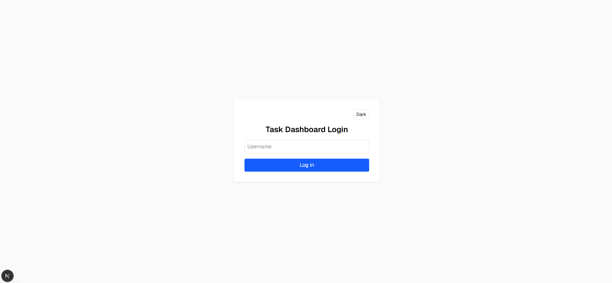
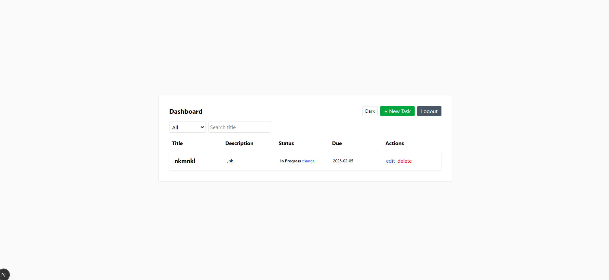

# Task  Dashboard

A simple Task  Dashboard built using:

- Next.js (App Router)
- TypeScript
- Tailwind CSS
- shadcn/ui
- LocalStorage (Mock Authentication & Data Persistence)

# 🚀 Setup Steps

## 1️⃣ Clone the Repository
git clone https://github.com/jerrin0256/task-dashboardd.git
cd task-dashboardd

## 2️⃣ Install Dependencies
npm install

## 3️⃣ Run the Development Server
npm run dev

## 4️⃣ Open in Browser
http://localhost:3000

# Screenshots
##  Login Page

##  Dashboard Page

##  Dark Mode

##  Create / Edit Task

#  Design Decisions

## 1. Mock Authentication Using LocalStorage

Since no backend was required, authentication is simulated using localStorage:

- On login → loggedIn flag is stored.
- Dashboard checks login state.
- Logout removes login state.

This keeps the implementation simple while demonstrating authentication flow.

## 2. Task Data Stored in LocalStorage

Tasks are stored in localStorage to:

- Persist data after page refresh
- Simulate real-world persistence
- Avoid backend dependency

## 3. Separation of Concerns

Task logic is separated into utility functions:
changeStatus
filterTasks
sortTasks

This improves:

- Maintainability
- Reusability
- Testability
- Cleaner UI components

## 4. TypeScript for Strong Typing

A strict Task interface is used:

ts
export interface Task {
  id: number;
  title: string;
  description: string;
  status: "Todo" | "In Progress" | "Completed";
  dueDate: string;
}
Benefits:

- No use of `any`
- Clear data model
- Improved scalability

## 5. App Router Architecture

layout.tsx → Server Component
Interactive pages → Client Components (`"use client"`)
Proper separation between UI and logic

This follows modern Next.js best practices.

# 📁 Folder Structure

src/
 ├── app/
 │    ├── dashboard/
 │    │    ├── page.tsx
 │    │    ├── Header.tsx
 │    ├── layout.tsx
 │    ├── page.tsx
 │    ├── globals.css
 │
 ├── components/
 │    ├── DarkModeToggle.tsx
 │
 ├── lib/
 │    ├── taskUtils.ts
 │
public/
 ├── screenshots/
 │    ├── login.png
 │    ├── dashboard.png
 │    ├── dark-mode.png
 │    ├── create-task.png

# Author

Jerrin K Joy
